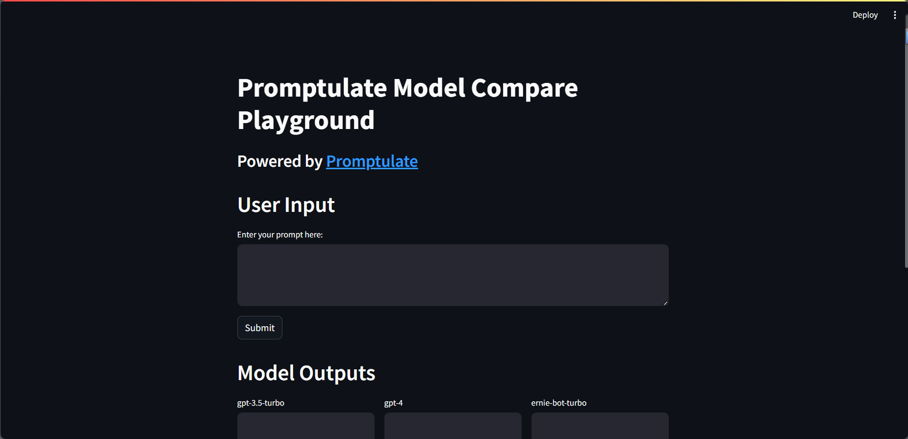

# Promptulate Playground - Model Comparison 

This is a demo streamlit app calling the server you created in your custom model comparison app by promptulate.

## Setup

```shell
cd pne-playground-model-comparison
pip install -r requirements.txt
```

Copy `.env.example` to `.env` at the same directory and setting your key in it.

```shell
python ./api.py
python ./app.py
```

Then you can see the following scenes.




## Further Reading

Learn more about how to use LangChain by visiting the official documentation or repo:

- https://github.com/Undertone0809/promptulate

- https://undertone0809.github.io/promptulate/#/